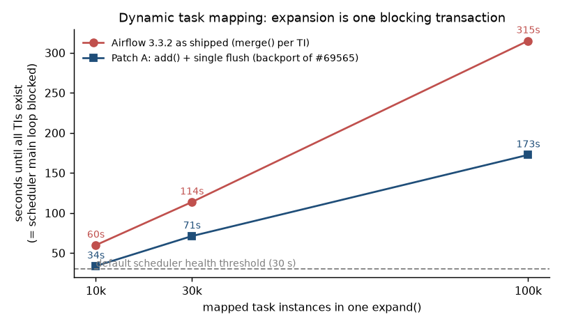
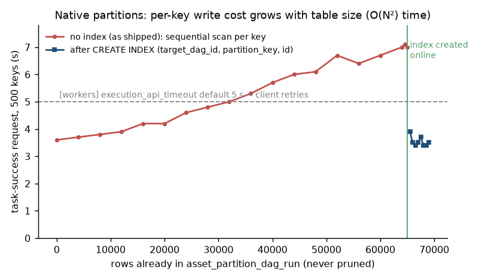
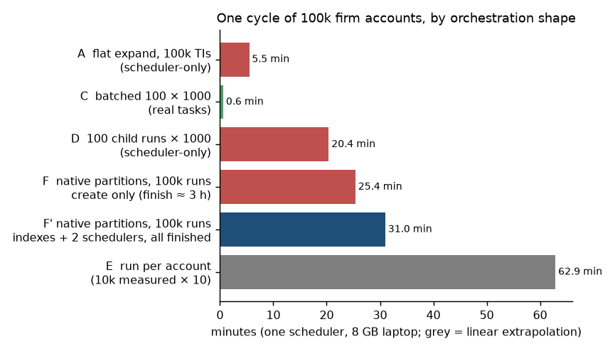
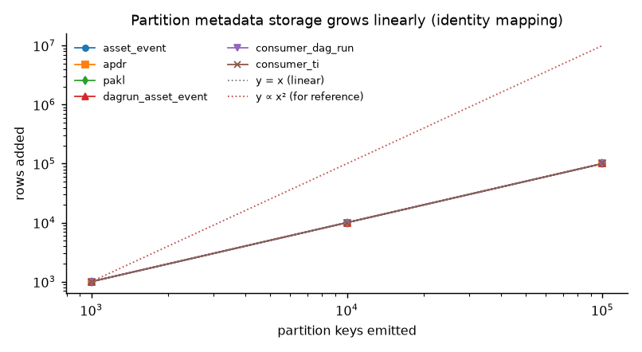

# Can Apache Airflow orchestrate 100k firm-account partitions?

Date: 2026-09-29 · Airflow under test: 3.3.2 (company baseline 3.3.0) plus `apache/airflow` main (3.4.0-dev, commit 73b07c5) for
source study · Repo: https://github.com/caoterry/airflow-100k-partitions

## 1. Executive summary

**Yes, Airflow can be made to carry 100k firm-account partitions, but not the way it ships today, and not on MWAA without
upstream changes.** Every number below was measured on Airflow 3.3.2 with Postgres 16 (`bench/`), with the code paths traced in
3.3.2 and on main.

1. **The partition feature already exists.** AIP-76 shipped in 3.2.0/3.3.0: one asset, free-form keys, one DagRun per key,
   `clearPartitions`, key filters. The company's 3.3.0 baseline has it. Nothing caps the number of keys.
2. **Fan-out of 100k units inside one DagRun is disqualified**, not merely slow. Expanding 100k mapped task instances is one
   scheduler transaction that blocks the scheduler loop for **317 s** (60 s at 10k) against a 30 s health threshold, and every
   mapped instance downloads the whole 100k-element input (**O(N²) bytes**, ≈150 GB per run). Batching 100 × 1000 does the same
   100k accounts in **38 s** (§4.5).
3. **Native partitions scale linearly in storage — the "n² growth" claim is wrong for storage — but quadratically in write
   time**, because `asset_partition_dag_run (target_dag_id, partition_key)` has no index and the table is never pruned. Measured:
   500-key registration 3.6 s → 7.0 s as the table grew to 60k rows, back to 3.4 s the moment an index existed (§4.2, §4.3).
   Within one request the cost is ~5 ms/key of round trips under an asset row lock, which, against the SDK's 5 s client timeout,
   caps a single emitting task at ~900 keys as shipped.
4. **At 100k keys the scheduler creates runs fast enough (~80/s) but finishes them at 3–10/s** on one scheduler; a plain
   run-per-account shape without the asset machinery reaches ~26–42 runs/s (§4.7). Either way, 100k account-level runs per cycle
   is an hour-scale scheduler cost before any business work.
5. **Two of the fixes were tried here.** Backporting upstream's expansion change (Patch A) gives 1.6–1.8× at every N (100k:
   315 s → 173 s) — real but not enough; a request-scoped cache in the partition write path (Patch C) gave **no** improvement,
   which pins the cost on per-key round trips and locking rather than deserialization. The index is the one change that pays
   immediately.
6. **MWAA makes all of this worse**: 3.3.1 only, no database access (no index, no APDR cleanup), Celery only, Execution API
   inside the webserver, 10 TPS REST throttle. Self-hosted Airflow removes the hard blockers.

**Recommendation.** Model firm accounts as native partition keys, but schedule at shard granularity (~1k shards × 100 accounts)
with per-account state in the 3.3 asset state store — this works on 3.3.1/MWAA today and is what AIP-104 (3.4) formalizes.
Pursue account-level runs only after the upstream items in §7 (APDR index + retention, bulk expansion, batched or
scheduler-side partition registration, configurable run creation) land in a release MWAA offers. The benchmark harness here is
the evidence for those PRs; the 3.4.0 feature freeze is 2026-10-12 (release manager's dev@ post of 2026-09-30; final release planned 2026-11-02).





*If images do not load on your network, every chart is also rendered as text in [docs/charts.md](docs/charts.md). The three above:*

```
N        as shipped (3.3.2)                            Patch A (backport #69565)
 10,000  ██████                            60 s   ███                               34 s
 30,000  ███████████                      114 s   ███████                           71 s
100,000  ██████████████████████████████   315 s   ████████████████                 173 s
default scheduler health threshold: 30 s  (every bar above is over it)
```

```
rows in APDR   request duration (500 keys)          | 5 s = client timeout

       0      ██████████████ 3.6 s
   8,000      ███████████████ 3.8 s
  16,000      █████████████████ 4.2 s
  24,000      ██████████████████ 4.6 s
  32,000      ████████████████████ 5.0 s
  40,000      ███████████████████████ 5.7 s
  48,000      ████████████████████████ 6.1 s
  56,000      ██████████████████████████ 6.4 s
  64,000      ████████████████████████████ 7.0 s
         ---- CREATE INDEX (target_dag_id, partition_key, id) online ----
  65,500      ████████████████ 3.9 s
  66,500      ██████████████ 3.4 s
  67,500      ███████████████ 3.7 s
  68,500      ██████████████ 3.4 s
```

```

A  flat expand, 100k TIs (scheduler-only)     ███   5.5 min 
C  batched 100 x 1000 (real tasks)            ▏   0.6 min 
D  100 child runs x 1000 (scheduler-only)     ██████████  20.4 min 
F  native partitions, create 100k runs        █████████████  25.4 min (finishing them ~3 h more)
E  run per account (10k measured x 10)        ███████████████████████████████  62.9 min (linear extrapolation)
```

## 2. The question, and the assumptions we had to make

A shared orchestration platform (balance-sheet + revenue teams) is being rebuilt cloud-native on Airflow or AWS MWAA. The revenue
team needs *partitioned processing keyed by firm account*, 30k–100k accounts. Dagster's partition model fits better but is not
allowed. "Can Airflow be pushed to 100k partitions?" splits into two questions that have different answers:

- **Fan-out:** can one cycle *run* 100k units of work?
- **Partition state:** can Airflow *track* 100k partitions (which account is materialized, re-run a chosen subset, history per account)?

Working assumptions (nobody was available to answer clarifying questions; see `docs/superpowers/specs/2026-09-29-airflow-100k-partitions-design.md`):
per-account work runs on an external engine and takes seconds to minutes; the cycle is daily; MWAA is the binding platform
constraint; experiments may use the newest 3.x.

## 3. What Airflow already ships for partitions (3.2 → 3.3 → main)

This changed the evaluation. AIP-76 "Asset Partitions" is not a proposal any more: **Airflow 3.2.0 (2026-04) shipped the data model
and 3.3.0 (2026-07) shipped the authoring API**, so the company's 3.3.0 baseline already has it. Full source analysis:
`docs/analysis/native-partitions-3.3.2-vs-main.md`.

- Producer: `outlet_events[asset].add_partitions([...keys])` inside a task (DAG on `PartitionedAtRuntime()` or any timetable).
- Consumer: `DAG(schedule=PartitionedAssetTimetable(assets=asset, default_partition_mapper=IdentityMapper()))` → **one DagRun per
  partition key**, `dag_run.partition_key` set, `{{ partition_key }}` in templates.
- Mappers: identity, temporal roll-ups (`StartOfDayMapper`…), `ProductMapper`, `FanOutMapper` (cap 1000), `AllowedKeyMapper`, `ChainMapper`.
- Operations: `GET /dagRuns?partition_key_pattern=…`, `POST /dags/{id}/clearPartitions`, `airflow partitions clear`, a
  "pending partitions" UI view.
- Not there: per-partition materialization status/"missing partitions" view, key-list backfill (only date ranges, only for
  `CronPartitionTimetable`), stale detection, dedup of re-emitted keys, retention for `asset_partition_dag_run` (rows are never deleted).

Keys are free-form strings ≤250 chars, so `ACCT00012345` works. Nothing caps the number of distinct keys.

**Is the use case aligned with where Airflow is going?** Yes. The "expanded data awareness" line (AIP-73/74/75/76) is complete
and AIP-103 (task/asset state store, 3.3.0) gives a per-asset key/value store suited to per-account watermarks. What is in flight
as of 2026-09-29 (3.4.0 feature freeze 2026-10-12 and final release 2026-11-02 per the release manager's dev@ post of 2026-09-30):

- **AIP-104 "Iterable Tasks and Task Spreading"** (PR #62922, milestone 3.4.0, updated 2026-09-29): `.iterate()` processes a
  collection inside one task instance with threads/async, `.spread(across=N)` splits items round-robin over exactly N task
  instances. Its motivation is literally that dynamic task mapping makes "each item a separate Task Instance". This is the
  first-class version of the batching pattern in §4.5.
- **AIP-88** streaming/lazy task expansion (WIP) and **AIP-100** scheduler starvation (awaiting review); starvation issues #45636
  and #49508 are on the 3.4.0 milestone.
- Partition follow-ups: #71070/#71074 duplicate pending runs for one key (bug + fix), **#71072 "log and audit when the
  partitioned-run per-tick cap is reached"** (someone else has hit the 500/tick cap), #68778 rollup re-run policy,
  #67941 `AssetPartitionSensor` / #70225 `AssetEventSensor`, #68517 `batch_asset_events`, #73119/#70444 deleting partitioned
  events, #64610 (merged for 3.4) `asset_event(asset_id, partition_key)` index and key filters.
- Airflow Summit 2026 (Nov 4–5) has a dedicated AIP-76 session by Wei Lee (Astronomer, the main implementer) on "authoring
  ergonomics, observability, and partition-aware workflow capabilities" — the same three gaps this report finds.

Nobody has proposed a per-partition materialization/"missing partitions" view, a key-list backfill, or any work at 10⁵ keys.
AIP-76's own design discussion assumed static partition sets would carry "an artificial limit similar to dynamic task
mapping's 1024". Dagster is not comfortable there either: its docs recommend ≤100,000 partitions per asset (raised from 25,000
only in 2025), with field reports of sensor timeouts at ~15k, a 90 s partitions tab at ~34k and a stalled backfill daemon at
~50k. "One partition per account" is a legitimate requirement; "100k scheduler-visible units per cycle" is at the edge of
every orchestrator.

## 4. Experiments

Environment: MacBook (8 cores, 8 GB RAM), Postgres 16 in Docker (`shared_buffers=512MB`, `synchronous_commit=off`), Airflow 3.3.2
in a Python 3.12 venv, LocalExecutor `parallelism=12`, `max_map_length=200000`, `max_active_tasks_per_dag=200000`, default pool
200000 slots, `max_tis_per_query=512`, everything else default. Harness: `bench/harness.py`; raw results: `bench/results/<label>/`.

### 4.1 Scenario A — flat dynamic task mapping, scheduler-only (`bench_flat_empty`)

One task returns N account ids; a mapped `EmptyOperator` subclass expands over them. The scheduler marks EmptyOperator instances
success without sending them to the executor, so this isolates **expansion + scheduling + metadata DB** cost.

| N | run duration | scheduler main loop blocked | scheduler peak RSS | API: list 100 TIs @offset 90k | UI grid summary |
|---|---|---|---|---|---|
| 1,000 | 12 s | – | 191 MB | – | 4 ms |
| 10,000 | 60 s | **61.5 s** | 313 MB | – | – |
| 30,000 | 116 s | **116.5 s** | 555 MB | – | – |
| 100,000 | 328 s | **316.7 s** | 959 MB | 381 ms | 6 ms |

It works, and it is close to linear (~3 ms per task instance at 100k). But the whole expansion happens **inside one scheduler loop
iteration and one database transaction**: `pg_stat_activity` showed a single transaction open for 5.3 minutes issuing 100,000
single-row `INSERT INTO task_instance …` statements followed by ORM `SELECT`s, while the scheduler's own heartbeat stopped
("Heartbeat recovered after 316.65 seconds"). Postgres was idle most of that time (`idle in transaction`, only three statements
over 100 ms); the cost is Python/ORM work in the scheduler process.

Why this is disqualifying rather than merely slow: the default scheduler health threshold is 30 s. A Kubernetes liveness probe
(`airflow jobs check`) or MWAA's managed health check would restart the scheduler mid-transaction, the transaction rolls back, the
run is picked up again and the cycle repeats. **Above roughly 5k mapped instances per task the expansion transaction already
outlives the default health threshold.**

The REST API and the endpoints the grid UI calls stayed interactive at 100k (every probed endpoint under 400 ms) with one
exception: `GET /dagRuns/{id}` took 8.4 s (`bench/results/flat_empty_100000/api_latency.json`).

### 4.2 Scenario F — native partitions (`bench_partition_producer` → `bench_partition_consumer`)

Producer emits N keys via `add_partitions`; consumer has `PartitionedAssetTimetable` + `IdentityMapper` and one EmptyOperator.

| N (emitters) | events written | all N runs created | all N runs finished | scheduler peak RSS | heartbeat gaps |
|---|---|---|---|---|---|
| 1,000 (1) | 12 s | 22 s | 41 s | 116 MB | none |
| 10,000 (1) | 76 s | 219 s | 426 s | 158 MB | none |
| 100,000 (200 × 500, serialized) | 1,505 s (25 min) | 1,524 s | stopped: 3.7k done after 26 min, ~3–10 runs/s | 155 MB | none |

Two things the 10k run exposed:

1. **The write path is one HTTP request.** Registering 10k keys happened inside the task-success call to the Execution API and took
   **53 s (≈5.3 ms per key)**. The SDK client timeout (`[workers] execution_api_timeout`) defaults to **5 s**, so the client retried
   five times; all six requests queued on the asset row lock and completed within the same 12 ms. The task process was then killed
   ("Server indicated the task shouldn't be running anymore"), although the TI ended as `success` and no duplicate rows were written
   (10,000 distinct events / APDR / PAKL rows). Practical consequence: **at default settings a single task can emit at most ~900
   keys**, and concurrent emitters serialize on the asset lock, so they must be run one at a time.
2. **Run creation is capped at 500 per scheduler tick** (`MAX_PARTITION_DAG_RUNS_PER_LOOP`, hard-coded). Measured steady state:
   ~80 runs/s. 100k keys ⇒ ~21 minutes of run creation per cycle, single-threaded, before any work runs.

The 100k run (200 emitters × 500 keys, serialized with `max_active_tis_per_dagrun=1`) added three more:

3. **The per-key write cost grows with the size of `asset_partition_dag_run`.** The task-success request for 500 keys took 3.6 s
   when the table was empty and 7.0 s at ~60k rows (API-server access log, 124 requests, monotonic). The reason is the
   per-key lookup `WHERE partition_key=? AND target_dag_id=? ORDER BY id DESC LIMIT 1`, which is a sequential scan: the
   committed `EXPLAIN` capture at 100k rows shows 3,306 shared buffers for the scan and 4 with the index
   (`bench/results/part_100k_e200/explain_apdr_queries.txt`; the ~1,800-buffer plan seen at 65k rows during the run was not
   captured). Past ~5 s the SDK client started timing out and retrying again.
   Creating the obvious index online (`(target_dag_id, partition_key, id DESC)`) at 00:36:07 dropped the same request to
   3.4 s immediately (4 buffers per lookup), removed the retries, and doubled the rate at which keys were registered and
   consumer runs created (47 → 94 per second, `bench/results/part_100k_e200/timeline.csv`). Run completion did not change in
   that window: 3,698 runs had finished at 00:36:13 and none finished in the next six minutes, because the scheduler loop was
   busy creating runs (item 4). Because the table is only pruned by `dag_run` cascade deletes and the scheduler's
   stale-fingerprint cleanup, without the index this cost keeps growing across days, not just within a cycle.
4. **Run creation keeps up; run completion does not.** All 100k `dag_run` rows existed 3 s after the last emitter finished
   (creation is bounded by emission, not by the 500/tick cap, once emitters are serialized). But the runs then finish at only
   3–10 per second: the scheduler examines `max_dagruns_per_loop_to_schedule` runs per loop (default 20, we used 200), each
   run needs at least two examinations (one to schedule the task, one to notice it finished), and the loop is pure Python.
   We stopped the run after 26 minutes with 3,698 runs finished and 96k queued/running; completing 100k trivial runs would
   have taken about three hours on one scheduler, with `max_active_runs` set to 100000. At the default `max_active_runs=16`
   it would take far longer.
5. **Scheduler memory stayed flat** (155 MB peak) — unlike dynamic task mapping, the partition path never holds 100k ORM
   objects at once.

### 4.2a The limit with the fixes in place — 100k partition runs in 31 minutes

Same 100k scenario (200 serialized emitters × 500 keys), as-shipped 3.3.2 code, but with hand-created indexes present
from the start (`patches/apdr_index.sql`: `(target_dag_id, partition_key, id DESC)` for the lookup, a Postgres partial index
`(created_at, id) WHERE created_dag_run_id IS NULL` for the pending scan, plus `dag_run (dag_id, partition_key)`) and
**two schedulers** (verified from `dag_run.creating_job_id`: scheduler jobs 13 and 16 created 48,000 and 52,000 runs). The
upstream PR (apache/airflow#73983) ships portable plain-composite equivalents — `(target_dag_id, partition_key, id)` and
`(created_dag_run_id, created_at, id)` — chosen for MySQL/SQLite; on Postgres the lookup plan is the same (index scan
backward, 4 buffers; see `bench/results/part_100k_e200/explain_apdr_queries.txt`), while the pending scan still sorts the
pending set (bounded by the number of pending rows rather than the table).

| milestone | as shipped, 1 scheduler, no index | indexes + 2 schedulers |
|---|---|---|
| all 100k keys registered | 1,505 s (emitter requests 3.6 → 7.0 s, retries) | **1,184 s** (5.9 s per 500 keys, no retries) |
| all 100k runs created | 1,524 s | 1,184 s (creation keeps pace with emission) |
| all 100k runs **finished** | stopped after 26 min with 3,698 done (≈3 h projected) | **1,860 s = 31 min**, 100,000/100,000 |
| completion rate once creation stopped | 3–10 runs/s | ~110 runs/s |
| scheduler peak RSS | 155 MB | 310 MB (per scheduler) |

Milestones (created → finished): 25k at 283 s → 784 s; 50k at 620 s → 1,419 s; 75k at 886 s → 1,664 s; 100k at 1,184 s →
1,860 s. All seven partition tables again grew by exactly 100,000 rows. The unindexed `asset_partition_dag_run` scans were
the dominant per-loop cost of the *scheduler* as well as of the write path; with them gone, an account-grain cycle of 100k
partition runs is a half-hour job on a laptop rather than a multi-hour one, and it splits across schedulers. This is the
"limit with the upstream index PR merged" number; the remaining ceiling is the emission rate (≤ ~900 keys per task, serialized)
and per-run scheduler work (~110 runs/s on two schedulers here).

### 4.2b Two schedulers (HA) — does adding schedulers help?

Same laptop, a second `airflow scheduler` process against the same Postgres (both share 8 cores, so absolute numbers are
pessimistic; the *ratios* are the point):

| scenario | 1 scheduler | 2 schedulers | reading |
|---|---|---|---|
| flat expand 30k (scheduler-only) | expansion 114 s | expansion **191 s**; the *other* scheduler had no heartbeat gap at all | expansion is one run in one transaction — a second scheduler cannot share it and only competes for CPU/DB; but the blast radius is one scheduler, the other keeps scheduling everything else |
| native partitions 10k, run creation after the events landed | 143 s | **67 s** (5,000 runs created by each scheduler job) | the 500/tick drain is `FOR UPDATE SKIP LOCKED`, so schedulers split the pending rows and creation scales ~linearly |
| native partitions 10k, run completion after creation | 207 s | **93 s** | the per-run scheduling work also splits across schedulers |

So for the partition path, MWAA's 2–5 schedulers are a real lever (≈2× per added scheduler here); for dynamic task mapping
they are not. Note that the HA duplicate-run race on `PartitionedAssetTimetable` (apache/airflow#68045, reproduced on MWAA
3.2.1) was fixed by #68061 (row lock on the APDR fetch) on 2026-06-10, so the 3.3.2 build measured here already carries the fix. The expansion transaction has to be fixed in code (§4.8, §7).

### 4.3 Does partition storage grow as n²? (question raised by a colleague's analysis)

**Storage: no.** For identity mapping (one account = one key) every table grows exactly linearly, measured at three scales:

| table | 1k keys | 10k keys | 100k keys | exponent |
|---|---|---|---|---|
| `asset_event` | 1,000 | 10,000 | 100,000 | 1.00 |
| `asset_partition_dag_run` (APDR) | 1,000 | 10,000 | 100,000 | 1.00 |
| `partitioned_asset_key_log` (PAKL) | 1,000 | 10,000 | 100,000 | 1.00 |
| `dagrun_asset_event` | 1,000 | 10,000 | 100,000 | 1.00 |
| `dag_run` / `task_instance` (consumer) | 1,000 | 10,000 | 100,000 | 1.00 |



*(text version: [docs/charts.md §4](docs/charts.md))*

**Time: yes, in the write path.** Registering key *i* scans the APDR table, which already holds *i−1* rows for this cycle plus
every previous cycle's rows (never pruned). Total write time per cycle is therefore O(N²) and gets worse every day. The
responsible table and columns are **`asset_partition_dag_run (target_dag_id, partition_key)`**, unindexed in 3.2.0 through
3.3.2 and on main as of 2026-09-30 (`models/asset.py`; only the primary key exists). Measured: 3.6 s → 6.7 s at 60k rows → 7.0 s at 64k rows per 500 keys;
3.4–3.9 s (median 3.5 s) the moment an index existed (§4.2; series in `bench/results/part_100k_e200/request_durations.csv`).

Why storage stays linear: when a partition run is created, only the events joined through *its own* PAKL rows are attached
(`scheduler_job_runner.py`, `PartitionedAssetKeyLog.asset_partition_dag_run_id == apdr.id`), not all events of the asset.
Quadratic *storage* would need a cross-product mapper (`FanOutMapper`/`ProductMapper`, bounded by `partition_mapper_max_downstream_keys`=1000).

The retention problem compounds it: `asset_partition_dag_run` rows are never deleted by the scheduler and are not cleaned by age themselves; they go only by
cascade when their `dag_run` is deleted by `airflow db clean` (pending rows never), so the unindexed hot table is bounded
only by the `dag_run` retention window — 36.5 M rows a year at 100k keys/day if runs are kept.
Measured row costs: `task_instance` ≈ 1 KB/row and `dag_run` ≈ 0.8 KB/row including indexes (243 MB and 81 MB after ~250k and
~100k rows), so one 100k-partition cycle per day is roughly 65 GB/year of metadata without retention.

A second quadratic behaviour lives in dynamic task mapping, not partitions: **each of the N mapped task instances downloads the
entire N-element upstream XCom** at start (`xcom_arg.py:338`, "No mapped task group - pull from unmapped instance"), i.e. O(N²)
bytes through the API server — measured as exactly N GETs per run in §4.4.

### 4.4 Scenario B — flat mapping, real execution (`bench_flat_python`)

Same shape as A but the mapped task is a real TaskFlow no-op, so every instance goes through the executor and the Task SDK
(LocalExecutor, `parallelism=8`, macOS fork+exec of a fresh interpreter per task instance).

| N | expansion (loop blocked) | run duration | throughput | task-process RSS (8 concurrent) | XCom GETs of the whole list | list size (JSONB) | GET p50 / p99 |
|---|---|---|---|---|---|---|---|
| 1,000 | 10 s | 297 s | 3.4 TI/s | 955 MB | 1,000 | 3.4 KB | 47 / 140 ms |
| 10,000 | 104 s | 3,254 s (54 min) | 3.2 TI/s | 962 MB | 10,000 | 35 KB | 78 / 172 ms |

Two things to read from this. First, the per-instance floor is the executor, not the scheduler: ~2.5 s of process start-up per
instance at 8-wide on this laptop, so 100k real instances would take ~9 hours here and scale only with worker count. Second, the
**whole-list pull is real**: the API-server access log shows exactly N `GET /execution/xcoms/…/make_ids/return_value` requests,
one per mapped instance, each returning the entire list. At 10k that is 10k × ~150 KB of JSON ≈ 1.5 GB through the API server —
tolerable. At 100k it is 100k × ~1.5 MB ≈ 150 GB per run, which is not. The expansion pause (104 s at 10k) is also longer than in
scenario A (60 s) because non-empty instances additionally go through `schedule_tis` state updates in the same transaction.
REST/UI probes against the finished 10k run all stayed under 700 ms.
### 4.5 Scenario C — batched mapping, 100 × 1000 (`bench_batched`)

`make_batches()` returns 100 lists of 1,000 account ids; `process_batch.expand(accounts=…)` runs 100 real instances.

| N accounts | Airflow units | expansion | run duration | metadata rows |
|---|---|---|---|---|
| 100,000 | 100 mapped TIs | 4 s | **38 s** | 101 TIs, 1 XCom of 100 lists |

Same 100k accounts as scenario A/B, ~1000× fewer scheduler and database operations, no heartbeat gap, and the mapped input
is pulled 100 times instead of 100,000. The price is that Airflow's UI shows batches, not accounts: per-account status has to
live somewhere else (the asset state store, or the compute engine's own bookkeeping).
### 4.6 Scenario D — two-level DAG-of-DAGs, 100 child runs × 1000 (`bench_two_level_*`)

A parent expands `TriggerDagRunOperator` 100 times; each child run expands 1,000 `EmptyOperator` instances (scheduler-only).

| accounts | child runs | child TIs | parent duration | all children finished | scheduler heartbeat gaps |
|---|---|---|---|---|---|
| 100,000 | 100 | 100,000 | 790 s | 20.4 min after first child started (child `dag_run` rows, `child_runs.csv`) | **up to 304 s** (scheduler log of that run, not committed) |

This shape does not automatically bound the scheduler pause. All 100 child runs were created within seconds, the scheduler
examines up to `max_dagruns_per_loop_to_schedule` runs per loop (200 here, default 20), and it expanded dozens of children
inside one loop iteration and one transaction: the scheduler log showed heartbeat gaps of 46, 49, 78, 198 and 304 s during this
scenario (that log was not committed and the committed timeline has no heartbeat column, so the gap figures cannot be re-derived
from the repository; the run duration can).
Per-batch run state comes for free, but with the default of 20 runs per loop a burst of 100 children still means ~20 × 1000
expansions per loop ≈ 2 minutes of blocked scheduler. It is strictly worse than scenario C for fan-out and only marginally
better than A for observability.
### 4.7 Scenario E — one DagRun per account, 10k (`bench_run_per_account`)

10,000 runs created through the REST API (`run_id = acct_<id>__<as_of>`, `conf.account`), each with one `EmptyOperator`, so
this isolates the scheduler's per-run cost — the same shape native partitions produce, without the asset machinery.

| runs | API trigger | queued → running | all finished | completion rate | scheduler RSS |
|---|---|---|---|---|---|
| 10,000 | 61.5 s (163 runs/s, p99 561 ms, 32 concurrent clients) | ~57 runs/s | 377 s | ~26 runs/s average, ~42 runs/s once finishing started | 160–180 MB |

Per-run scheduler cost is therefore ~25–40 ms on one scheduler when the runs already exist. Scaled linearly, 100k
account-level runs need ~1 hour of scheduler time per cycle just to be started and finished, before any real work; the
native-partition path measured 3–10 runs/s (§4.2) because creation (500 per tick) and completion compete inside the same
loop. Creating the runs is cheap by comparison: 163 runs/s through the API here, but MWAA throttles its REST endpoint at
10 requests/s, i.e. ~2.8 hours to create 100k runs there.
### 4.8 Before/after with two upstream-style patches (`patches/`)

**Patch A** backports apache/airflow#69565 ("Speed up dynamic task mapping expansion", merged for main 2026-07-14, milestone
3.3.1, but not present in the 3.3.1/3.3.2 wheels): mapped instances are `session.add()`-ed and flushed once instead of
`session.merge()`-ed one by one, which removes one SELECT per instance and lets the INSERTs batch.

| N | as shipped: loop blocked | Patch A | speed-up | scheduler peak RSS |
|---|---|---|---|---|
| 10,000 | 59.9 s | 33.8 s | 1.77× | 313 → 316 MB |
| 30,000 | 113.7 s | 71.2 s | 1.60× | 555 → 508 MB |
| 100,000 | 315.0 s | 172.6 s | 1.83× | 959 → 1,082 MB |

Real, linear, and not enough: the loop is still blocked for ~3 minutes at 100k. `pg_stat_activity` during the patched
expansion shows the connection idle for long stretches right after `SELECT max(map_index)` (pure Python: constructing N
`TaskInstance` objects, mutation hook, `refresh_from_task`) followed by one `SELECT task_instance…` per new instance (the
`MappedTaskUpstreamDep` check). Getting to seconds needs bulk INSERT without ORM objects plus a hoisted upstream check, or
chunked expansion across loops (§7, items 2 and 6).

**Patch C** memoises the consumer DAG deserialization, rollup fingerprint, asset row and mapper per request in
`_queue_partitioned_dags`, and was run together with the three indexes in `patches/apdr_index.sql`, on the 10k-keys /
single-emitter scenario:

| | as shipped | Patch C + indexes |
|---|---|---|
| task-success request registering 10k keys | 53 s (+5 retries) | 57.5 s (+5 retries) |
| all 10k runs created | 219 s | 226 s |
| all 10k runs finished | 426 s | 494 s |

No improvement — a useful negative result. The API server's statement mix during the request (`pg_stat_activity`, 539
samples) is ~8 statements per key: `SELECT asset`, `SELECT asset_alias … IN (NULL)`, `SELECT dag` (consumers),
`SELECT asset FOR NO KEY UPDATE` (the lock), `SELECT asset_partition_dag_run`, `INSERT asset_partition_dag_run` + flush,
`INSERT partitioned_asset_key_log`, `INSERT asset_event` + flush — almost all sampled as `idle in transaction`, i.e. the time is
ORM round trips and flushes per key, not deserialization. The index does not help on an empty table (the seq scan is cheap
until the table grows) — which is exactly why it helped so much at 65k rows in §4.2. The structural fix is to register keys
in bulk per request (one INSERT for events, one for APDRs, one for PAKLs, one lock) or to move the fan-out out of the request
entirely and let the scheduler materialize pending partitions from new events in batches.

## 5. Where the time goes (source ↔ measurement)

Details with file:line references: `docs/analysis/dynamic-task-mapping-expansion-path-3.3.2.md`.

| # | Mechanism | Evidence | Scales as |
|---|---|---|---|
| 1 | Mapped-TI creation: Python loop, `session.merge` per TI (SELECT + single-row INSERT), per-TI `MappedTaskUpstreamDep` query, all in one transaction — the code carries `# TODO: Make more efficient with bulk_insert_mappings` | 61 / 117 / 317 s blocked loop at 10k / 30k / 100k | O(N) per expansion, blocking |
| 2 | Every scheduler loop re-hydrates all TIs of each running DagRun as ORM objects; critical-section query sorts all SCHEDULED TIs with a window function | scheduler RSS 959 MB at 100k | O(N) per loop for the life of the run |
| 3 | Each mapped TI pulls the whole upstream XCom | 1,000 / 10,000 GETs of the full list per run, 35 KB (JSONB) at 10k, p50 78 ms | O(N²) bytes |
| 4 | Partition key registration runs inside the task-success API request under the asset row lock, ~8 statements per key, APDR lookup unindexed | 5.3 ms/key; 53 s for 10k; client timeout 5 s; +50% per 60k rows in the table | O(keys) per request, O(table) per key |
| 5 | Partition runs created ≤500 per tick, FIFO, single scheduler | ~80 runs/s | O(N/500) ticks |
| 6 | `asset_partition_dag_run` PK-only index; trimmed only by cascade with `dag_run` cleanup | code | bounded by run retention |

## 6. How to model 100k firm accounts on Airflow 3.3 today

Separate the two requirements from §2 and give each the mechanism that scales:

**Partition state (per account): native partition keys, one asset, identity mapping — but at the granularity the scheduler
can carry.** Two workable shapes, depending on what the platform allows:

- *Shape 1 — account-level runs (100k partition runs per cycle).* Correct semantics out of the box (`dag_run.partition_key` =
  account, `clearPartitions`, `GET /dagRuns?partition_key_pattern=`). Requires all of: the APDR index (needs DB access →
  self-hosted only), emitters serialized and ≤ ~900 keys each (or `[workers] execution_api_timeout` raised), `max_active_runs`
  raised far above 16, several schedulers, and acceptance that completion throughput is ~10 runs/s/scheduler today (§4.2).
  Not viable on MWAA as shipped.
- *Shape 2 — shard-level runs (e.g. 1,000 shards × 100 accounts), account-level state.* Partition key = shard id (hash bucket,
  book, region); inside the shard run, fan out over its accounts with a bounded `expand()` (≤ 1024, the default
  `max_map_length`, and small enough that the whole-list XCom pull is harmless) or an in-task loop / AIP-104 `.iterate()`
  when 3.4 lands. Per-account outcome and watermark go to the 3.3 **asset state store** (`asset_state_store`, PK asset+key),
  which is the sanctioned per-key store and holds 100k keys under one asset. Re-running one account = re-running its shard
  with a `conf` filter, or a small "repair" DAG that takes an explicit account list. Everything in this shape works on
  3.3.1/MWAA today with no code changes.

**Fan-out (per-cycle compute): never 100k task instances in one DagRun.** Scenario A shows the expansion transaction alone
blocks the scheduler for 5 minutes; the whole-list XCom pull makes real execution O(N²) in bytes. Keep any single `expand()`
in the low thousands, prefer batches (§4.5) or child runs (§4.6), and push per-account parallelism into the compute engine.

**Shared-platform hygiene.** Give revenue its own pool and `priority_weight`, cap `max_active_runs` per DAG, and budget
metadata retention per cycle (`airflow db clean` on `dag_run`/`task_instance`; APDR needs an upstream fix to be cleanable at
all). On MWAA, consider a separate environment for the partitioned workload rather than pools — `multi_team` is blocked there.

Recommendation: **Shape 2 now** (it is also what AIP-104 is formalizing), with the state-store convention designed so that a
later move to Shape 1 is a key-format change, not a re-architecture — once the upstream fixes in §7 ship in a release MWAA offers.

## 7. What to contribute upstream

Ordered by impact ÷ effort. Items 1–3 are small, self-contained, and backed by measurements in this repo; the 3.4.0 feature
freeze is 2026-10-12, so realistically these land in 3.4.x/3.5 and reach MWAA a month after that.

| # | Change | Evidence | Size |
|---|---|---|---|
| 1 | **Indexes on `asset_partition_dag_run`**: `(target_dag_id, partition_key, id)` for the write path and `(created_dag_run_id, created_at, id)` for the scheduler's pending scan — branch `caoterry/airflow:apdr-indexes-and-cleanup` | §4.2/§4.2a: 7.0 s → 3.4 s per 500 keys, retries gone; 100k runs finished in 31 min instead of ~3 h | migration, tiny |
| 2 | **Bulk-create mapped task instances** (`TaskMap.expand_mapped_task`): ship #69565 in a 3.3.x patch release (Patch A: 1.6–1.8×), then go further — bulk INSERT without per-instance ORM objects and a hoisted `MappedTaskUpstreamDep` check | §4.1/§4.8: 315 s → 173 s at 100k with #69565 alone | backport + medium PR |
| 3 | **Batch the partition write path per request**: one lock, bulk INSERT of `asset_event`/APDR/PAKL, `INSERT … ON CONFLICT` on a partial unique index instead of get-or-create per key; or move fan-out to the scheduler (level-triggered) | §4.8: memoisation alone changes nothing; ~8 statements per key | medium |
| 4 | **Make `MAX_PARTITION_DAG_RUNS_PER_LOOP` configurable** and bulk-insert the created `dag_run`/`task_instance` rows (the time-based path already uses `bulk_insert_mappings`) | §4.2: ~80 runs/s creation ceiling | small |
| 5 | **Index-aware XCom fetch for mapped operands**: explode a mapped input into per-index rows at push time (the `LazyXComSequence` path that exists for mapped upstreams), so each mapped TI pulls one item | O(N²) bytes (§4.4) | medium |
| 6 | **Incremental ("level-triggered") expansion**: expand K instances per scheduler loop with a cursor, commit between chunks, keep the `map_index=-1` sentinel until complete | bounds heartbeat gap independent of N | medium, needs dev-list discussion |
| 7 | **Key-list backfill / clear** (`partition_keys: list[str]` selector on backfill and `clearPartitions`) and `iter_partition_dagrun_infos` for `PartitionedAssetTimetable` | today: date ranges only, cron timetable only | medium |
| 8 | **Per-partition status endpoint/view** ("materialized / pending / missing / stale" per key, derived from `dag_run.partition_key` + `asset_state_store`) | the Dagster gap that matters most to users | medium–large, UI |
| 9 | Readiness-aware APDR selection (avoid FIFO head-of-line blocking); fast path for single-asset identity consumers (skip fingerprint/APDR/PAKL) | code comments in `scheduler_job_runner.py` | medium |
| 10 | Doc fixes: `assets.rst` "back-fill partition_key" claim vs code; `manager.py` reference to a non-existent mutex table; document `execution_api_timeout` vs `add_partitions` size | trivial |

The benchmark harness in this repo (`bench/`) reproduces every number above on a laptop and is the natural attachment for
the dev-list thread and the PRs.

## 8. Platform constraints: MWAA vs self-hosted

Everything above gets harder on MWAA, and every fix arrives later (sources: MWAA user guide pages as read 2026-09-29, in
`docs/research/`):

- **Versions/images.** MWAA offers 3.3.1 (since 2026-09-01), 3.2.1 and 3.0.6; there is no 3.3.0 and no 3.1.x, and only
  AWS-built images are allowed. Upstream fixes reach MWAA 3–4 weeks after an Apache release at best. Local patches (§7) are
  impossible there.
- **No database access.** The metadata DB is a single-tenant Aurora PostgreSQL (max 8 vCPU/64 GB) that customers cannot
  connect to, size or tune. The missing APDR index cannot be added by the customer; `airflow db clean` runs only through the
  CLI endpoint and does not cover APDR rows anyway.
- **Executor and sizing.** CeleryExecutor only (executor, broker, `parallelism` and `worker_autoscale` are reserved), 2–5
  schedulers, 1–25 workers (50 by quota), largest class mw1.2xlarge = 16 vCPU/48 GB per scheduler. A 5-minute blocked
  scheduler loop (§4.1) sits under an AWS-managed health check whose threshold is not documented.
- **Execution API inside the webserver.** On Airflow 3 MWAA runs the Task Execution API in the 2–5 webserver Fargate
  containers (autoscale at CPU >70%). Both heavy paths we measured — the whole-list XCom pull per mapped task instance and the
  per-key partition registration — land there, with no published sizing guidance.
- **REST throttle 10 TPS.** Triggering or re-running partitions through the API tops out at ~36k requests/hour.
- **Config overrides are allowed** for `core.max_map_length`, `scheduler.max_tis_per_query`, `scheduler.max_dagruns_*`,
  `core.max_active_runs_per_dag` etc.; only `core.multi_team` and `triggerer.queues_enabled` are blocked.
- **MWAA Serverless** (GA 2025-11) is out of scope: Airflow 3.0.6, 100 workflows/account, 20 concurrent runs per workflow,
  no dynamic task mapping.

Self-hosted Airflow on Kubernetes removes the first two bullets entirely and gives control over the third. If MWAA is mandatory,
the design has to stay inside what 3.3.1 does well out of the box: ≤ ~900 keys per emitting task, a few thousand partition
runs per cycle, batching inside runs. The recommended Shape 2 (§6) already does: it needs none of the fixes in §7, so the
platform choice only decides how soon Shape 1 becomes available (see the platform-options table under Q5 in
`docs/answers-to-mwaa-discussion.md`).

## 9. Reproduce

```bash
git clone https://github.com/caoterry/airflow-100k-partitions && cd airflow-100k-partitions
# see README.md: Postgres in Docker, uv venv, bench/ctl.sh init && start, then bench/harness.py …
```
