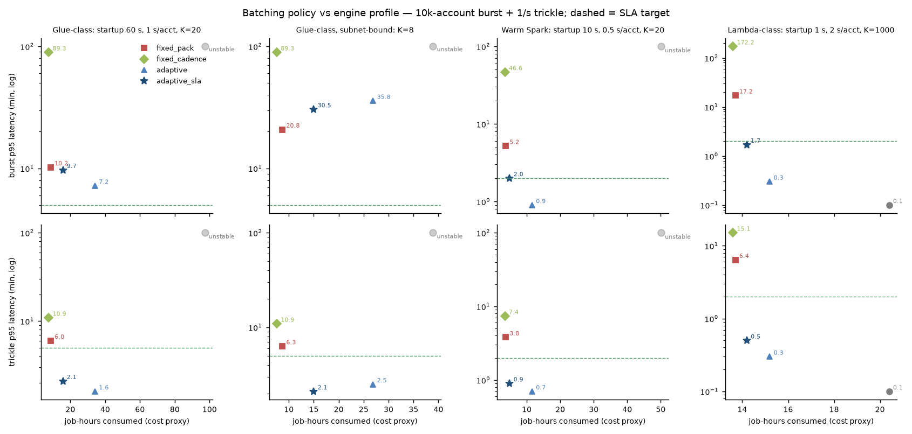

# Dynamic, capacity-aware batching for account-grain PnL

*2026-09-30. Simulation: `bench/sim_batching.py`, `bench/sim_charts.py`. Airflow prototype: `bench/dags/exp_e5_dynamic_batcher.py`,
driver `bench/exp_e5.py`. Complements §6 of [REPORT.md](../REPORT.md) and Q3/Q6 of the [answers](answers-to-mwaa-discussion.md).*

## 1. The problem, stated as a control problem

Revenue's inputs arrive per firm account: a start-of-day burst (up to 10k–100k accounts within minutes) followed by a trickle
for the rest of the day. A calculation job costs `S + p·b` seconds of wall time (`S` = engine start-up, `p` = per-account
compute, `b` = accounts in the batch), and at most `K` jobs run concurrently. `K` is the real constraint on AWS: Glue/EMR
workers each take an ENI and a private IP, so a /24 subnet shared with other tenants leaves room for a handful to a few dozen
concurrent jobs. The SLA target on the proposal page is p95 ≤ 2 minutes from data arrival to result.

Fixed batching cannot serve both regimes: big packs amortize `S` in the burst but make the trickle wait to fill; small packs
serve the trickle but burn capacity on start-ups during the burst. **Dynamic batching** decides `b` at each scheduler tick from
the current ready set, the measured arrival rate `λ`, the free capacity and the oldest waiting account.

### Policies compared
| policy | rule |
|---|---|
| `per_account` | one job per account, FIFO through K slots |
| `fixed_pack` | dispatch when `pack_size` (500) accounts are ready or the oldest has waited `t_max` |
| `fixed_cadence` | every 5 min, everything ready as one job |
| `adaptive` | latency-optimal size `b = √(2·λ·S/p)`, never below the **capacity floor** `b_cap = λ·S / (K − λ·p)` (the smallest batch at which K slots sustain λ), split across free slots, dispatch when ≥ `b_min` ready or oldest > `t_max` |
| `adaptive_sla` | same floor, but size = the **largest** batch whose expected latency `b/λ + S + p·b` still meets the target — minimizes cost subject to the SLA |

The capacity floor is what makes the policy stable: without it (first version of the simulator) a 100k burst at K=50
saturated the slots with small jobs and the tail grew to 43 minutes.

## 2. Simulation results (10k-account burst over 10 min, then 1 account/s for 4 h)



*Text version of this figure (for networks that block images): [charts.md §5](charts.md). Two of the four panels:*

**Glue-class: startup 60 s, 1 s/acct, K=20, SLA 5 min**

| policy | jobs | avg batch | burst p95 | trickle p95 | job-hours |
|---|---|---|---|---|---|
| per_account | 5,740 | 1.0 | unstable | unstable | 97.3 |
| fixed_pack | 116 | 211.4 | 10.2 min | 6.0 min | 8.7 |
| fixed_cadence | 50 | 490.3 | 89.3 min | 10.9 min | 7.6 |
| adaptive | 1,643 | 14.9 | 7.2 min | 1.6 min | 34.2 |
| adaptive_sla | 534 | 45.9 | 9.7 min | 2.1 min | 15.7 |

```
trickle p95 (min)
fixed_pack     ████████████   6.0   (8.7 job-h)
fixed_cadence  ██████████████████████  10.9   (7.6 job-h)
adaptive       ███   1.6   (34.2 job-h)
adaptive_sla   ████   2.1   (15.7 job-h)
SLA target     ----------| 5 min
```

**Glue-class, subnet-bound: K=8, SLA 5 min**

| policy | jobs | avg batch | burst p95 | trickle p95 | job-hours |
|---|---|---|---|---|---|
| per_account | 2,296 | 1.0 | unstable | unstable | 38.9 |
| fixed_pack | 114 | 215.1 | 20.8 min | 6.3 min | 8.7 |
| fixed_cadence | 50 | 490.3 | 89.3 min | 10.9 min | 7.6 |
| adaptive | 1,208 | 20.3 | 35.8 min | 2.5 min | 26.9 |
| adaptive_sla | 492 | 49.8 | 30.5 min | 2.1 min | 15.0 |

```
trickle p95 (min)
fixed_pack     █████████████   6.3   (8.7 job-h)
fixed_cadence  ██████████████████████  10.9   (7.6 job-h)
adaptive       █████   2.5   (26.9 job-h)
adaptive_sla   ████   2.1   (15.0 job-h)
SLA target     ----------| 5 min
```

**Warm Spark: startup 10 s, 0.5 s/acct, K=20, SLA 2 min**

| policy | jobs | avg batch | burst p95 | trickle p95 | job-hours |
|---|---|---|---|---|---|
| per_account | 17,180 | 1.0 | unstable | unstable | 50.1 |
| fixed_pack | 116 | 211.4 | 5.2 min | 3.8 min | 3.7 |
| fixed_cadence | 50 | 490.3 | 46.6 min | 7.4 min | 3.5 |
| adaptive | 2,959 | 8.3 | 0.9 min | 0.7 min ◀ meets SLA | 11.6 |
| adaptive_sla | 554 | 44.3 | 2.0 min | 0.9 min ◀ meets SLA | 4.9 |

```
trickle p95 (min)
fixed_pack     ████████   3.8   (3.7 job-h)
fixed_cadence  ███████████████   7.4   (3.5 job-h)
adaptive       █   0.7   (11.6 job-h)
adaptive_sla   ██   0.9   (4.9 job-h)
SLA target     ----| 2 min
```

| engine profile | best policy for the 2-min trickle SLA | burst p95 (capacity-bound) | cost vs fixed pack |
|---|---|---|---|
| **Glue-class** S=60 s, p=1 s, K=20 | `adaptive_sla` (target 5 min): trickle p95 **2.1 min** | 9.7 min for every policy except `adaptive` (7.2) | 1.8× (15.7 vs 8.7 job-h) |
| Glue-class, subnet-bound K=8 | `adaptive_sla`: trickle 2.1 min | **30 min** — no policy helps; only K does | 1.7× |
| **Warm Spark** S=10 s, p=0.5 s, K=20 | `adaptive_sla`: **burst 2.0 / trickle 0.9 min** | 2.0 min | 1.3× (4.9 vs 3.7 job-h) |
| **Lambda-class** S=1 s, p=2 s, K=1000 | `per_account`: **p95 6 s** in both phases; `adaptive_sla` 1.7 / 0.5 min | — | per-account = 20 job-h of pure compute, no start-up waste |
| Lambda-class, 100k burst in 30 min | `per_account` p95 6 s; `adaptive_sla` 2.0 / 0.8 min | — | — |

`per_account` on a Glue-class engine is **unstable** at 1 account/s with K ≤ 50: 60 s of start-up per account means K
slots sustain only K/61 accounts per second, so the queue never drains (18,777 accounts still waiting after 4 h at K=20).

Three conclusions:

1. **In the burst, latency is set by capacity, not policy:** p95 ≈ N·p/K + S. Turned around, the capacity you need for an
   SLA is `K ≥ N·p / (SLA − S)`, and on AWS `K` translates to IP addresses: a job with `w` workers needs `w+1` IPs.
2. **In the trickle, latency is set by start-up cost:** p95 ≥ S + fill time. With S = 60 s only small batches meet 2 minutes,
   at 2–4× the job-hours; with S = 10 s the SLA is met at 1.3×; with S ≈ 1 s per-account execution is simply the best option.
   So the lever for the SLA is the engine's start-up cost, not the orchestration policy.
3. **What dynamic batching buys:** one policy that is never unstable, gives small-batch latency in the trickle and big-batch
   cost in the burst, and needs no per-phase tuning. `adaptive_sla` is the defensible default: "as large as the SLA allows".

## 3. Engine choice: why the 100k-unit case points away from Spark

If the per-account PnL has no cross-account netting (revenue) and inputs can be read per account (storage partitioned by
firm account, or a key-value slice), the work is embarrassingly parallel and a Lambda-class engine fits it: ~1 s start-up,
account-level concurrency in the thousands, and in a VPC it uses shared Hyperplane ENIs rather than one IP per worker, so the
subnet ceiling largely disappears. Rough cost per 100k accounts at 2 s × 2 GB each is in the single-digit dollars — the same
order as Glue's DPU-hours for the same compute — so cost is not the discriminator; latency and operational simplicity are.
The proposal page's own list ("alternative execution engines: kedro / polars") is this direction. Balance sheet, with
cross-account netting, remains a Spark-shaped job.

What this does to orchestration: **Airflow's unit stays the batch.** One task hands a batch of accounts to the fan-out
mechanism (Step Functions Distributed Map, SQS + Lambda, or a boto3 async fan-out inside the task), waits (deferrably), then
emits one keyed asset event per account and updates per-account status — exactly E4/E5 with a different `spark` step. Airflow
never sees 100k task instances; per-account parallelism lives in the engine. Per-account lineage and status stay in Airflow.

## 4. Mapping onto Airflow 3.3 primitives

| concept | Airflow primitive |
|---|---|
| capacity `K` (IPs, DPUs, engine concurrency) | a **pool** (`spark_jobs`, K slots); heterogeneous jobs use `pool_slots = workers + 1`; excess batches queue in Airflow = back-pressure |
| batch decision | `claim` task: ready set from the event log (`inlet_events[input].after(watermark)`), in-flight set and per-account status from the **asset state store**, `plan_batches()` = the policy |
| one job per batch, capacity-gated | `spark.expand(batch=batches)` with `pool="spark_jobs"`; in production `GlueJobOperator(deferrable=True)` / `LambdaInvoke…` so waiting does not hold a worker slot |
| per-account lineage from a batch | `publish.expand(...)`: `outlet_events[output].add_partitions(batch)` — one event per account, `source_run_id` = the batch run |
| failure semantics | `release` task with `trigger_rule="one_failed"` resets the claims; claims carry the batch id so a stale "running" can be detected |
| cadence | cron every minute (keyed events do not trigger non-partitioned DAGs); the policy's `t_max` bounds the added wait |

Two implementation details learned the hard way: the state-store accessor is scoped to the task's declared
inlets/outlets (declare `inlets=[input]` on every task that touches it), and "processed" must mean `status == done`, not
"a version was recorded", or released accounts are never re-claimed.

## 5a. Airflow prototype at 10k accounts — what breaks in the batcher itself

`bench/exp_e5.py --burst 10000 --burst-runs 20 --K 3 --startup 15 --per-account 0.02 --b-max 600 --target 120`
(20 producer runs × 500 keys, then 40 trickle accounts). Three versions of the `claim` task were needed:

| version | failure | fix |
|---|---|---|
| v1: `inlet_events[input]` for the whole window, one state-store `get` per account | the event pull for 10k events took **7.6–9.1 s** and hit the SDK's 5 s `execution_api_timeout` → claim task failed every minute | page the event log: `.after(watermark).ascending(True).limit(2000)` in a loop (6 pages, ≤ 2 s each); one `ledger` key instead of 10k `get`s |
| v2: paged pull, watermark advanced to the last event | dispatched 3 × 600, then the other 8,200 ready accounts **vanished** — the watermark had moved past their events and nothing remembered them | persist the `pending` set in the ledger (`pending / inflight / processed`); the watermark only bounds what to *read* |
| v3: persistent ledger | works end to end: 10,040 accounts in 17 batches of ~590, 9,600+ per-account downstream runs; but `claim` and `publish` both `get → modify → set` the same ledger key and overwrite each other, so `inflight` stuck at 1,800 and only one new batch was released per minute instead of three | production: keep the ledger in a table with row locks or conditional writes (Postgres `SELECT … FOR UPDATE`, DynamoDB conditional update), or make the batcher single-writer |

| v4: ledger in an external Postgres table (`bench/dags/ledger_pg.py`), `claim` = `SELECT … FOR UPDATE SKIP LOCKED` + plan + mark inflight in one transaction | — | 3 × 600 dispatched every minute the slots were free, no lost updates: 18 jobs, **burst p95 8.1 min** (vs 16.8 min with the state-store ledger), trickle p95 8.1 min, claim avg 3.3 s |

Measured on v3: claim 1.1–12.1 s (avg 2.1 s; the 12 s one is the six-page burst pull); burst p95 **17 min**, entirely
throughput-bound by the ledger race (600 accounts/min instead of 1,800/min). v4 removes the race and halves the latency; the
remaining gap to the 5.6-minute floor (10k ÷ 1,800 per minute) is the one-minute cadence — a claim that finds all three
slots busy waits a full minute. The lesson generalises: a batcher is a small
stateful service — the event log is its input stream, but "seen and not yet dispatched", "dispatched and not yet done" and
"done at version v" are its own state, and none of them can be re-derived per tick at 10k accounts within a 5-second API
budget. The balance-sheet gate (E6) gets away with no state because it recomputes the whole result each time and lets
`max_active_runs=1` act as its in-flight flag; anything that processes *subsets* concurrently needs the ledger.

### 100k accounts through the batcher (Postgres ledger, K = 10, 600 per batch) — first attempt, partial

200 producer runs × 500 keys, then 40 trickle accounts. The mechanics held at this scale — `claim` 1.3–3.2 s (avg 1.8 s) with
100k events behind it, 90 batches of exactly 600, no failed tasks, 54,000 accounts published within the driver's 40-minute
window, 40,040 still pending, 6,000 in flight — but throughput was only ~1,350 accounts/min against a slot capacity of
~13,000/min. Two experiment-design reasons, not batcher reasons: the one-minute cron with `max_active_runs=2` serialises
"dispatch → wait for publish to clear the ledger → dispatch" into a ~4-minute cycle, and the downstream per-account
`rev5_pnl_consumer` was simultaneously creating 54,000 partition runs on the same scheduler (the same load as the 100k
limit run in the report). **Rerun in isolation** (downstream consumer paused, `max_active_runs=4`, K = 10): emission of the 100k input events took 6 min
(20:02–20:08); the batcher then published 84,000 accounts in the next 30 minutes (140 batches of 600, pool queue wait p50 0 s /
max 7 s), leaving 10,040 pending and 6,000 in flight when the driver's 40-minute window closed — about 2,800 accounts/min
against a slot capacity of ~13,000/min. This time the limiter was neither the scheduler nor the ledger but the **Execution API
server**: every `publish` registers 600 partition keys in one task-success request (~5 ms per key, serialized on the asset row
lock), so 100k keys cost roughly 8–9 minutes of API-server time, and the `claim` task's paged event pulls queued behind those
requests (claim 1.3 s when the API was idle, 34 s on average and up to 388 s at peak). Per-account lineage through asset
events therefore has a floor of ~5 ms per key regardless of orchestration shape — the same write path the index PR does not
change (the lookup was already indexed here) and that the untried "batched key registration" fix (report §7, item 3) targets.
On MWAA this cost lands on the webserver containers. Practical reading: 100k keys/day ≈ 10 minutes of API time is an acceptable
daily budget, but not something to spend inside a latency-critical window; emit lineage keys per batch rather than per account
if the per-account status lives in the ledger anyway.

## 5b. Airflow prototype (E5) — burst of 60 accounts, then 1 account every 6 s; K = 3, S = 15 s, p = 0.5 s

Same load for both policies (60 accounts in three producer runs, then 30 accounts one every 6 s); `spark` sleeps
`15 + 0.5·b` seconds inside the 3-slot pool; latency measured from the account's input event to its `rev5_pnl` event in
`asset_event`.

| policy | batches dispatched (burst → trickle) | jobs | burst p95 | trickle p95 (max) | downstream per-account runs |
|---|---|---|---|---|---|
| `adaptive_sla` (target 90 s) | 22 / 22 / 22 → 5 / 5 → 10 → 4 | 7 | **64 s** | **77 s** (79) | 90 |
| `fixed` (10 per batch) | 10 ×6 + 5 (7 jobs for 3 slots → 4 wait in the pool) → 10 / 1 → 10 → 4 | 11 | 92 s | 128 s (137) | 90 |

What the run shows mechanically: the claim task sized the burst to the free capacity (three batches for three slots, one
job per slot, no pool queueing), then shrank batches to 4–10 in the trickle; the fixed policy over-split the burst (seven
10-account jobs for three slots, so four waited in the pool and every account paid an extra start-up) and under-served the
trickle (waiting up to `t_max` to fill ten). All 90 accounts produced one keyed `rev5_pnl` event each, from 7 (or 11)
publishing task instances, and the partitioned consumer created exactly 90 per-account runs — per-account lineage from
batch-grain scheduling, on stock Airflow 3.3.2. The fixed policy here is deliberately naive; the point of the prototype is
the mechanism (event log + state store + pool + policy), not the margin.
