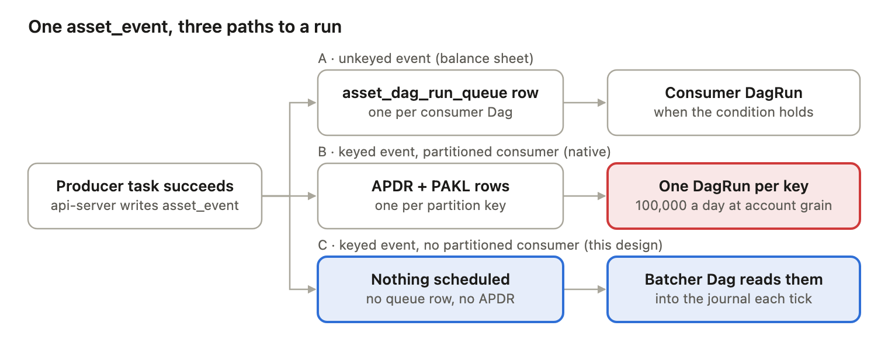
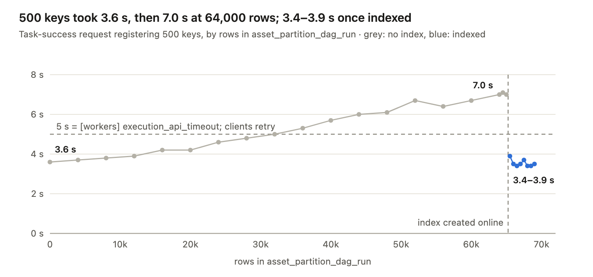
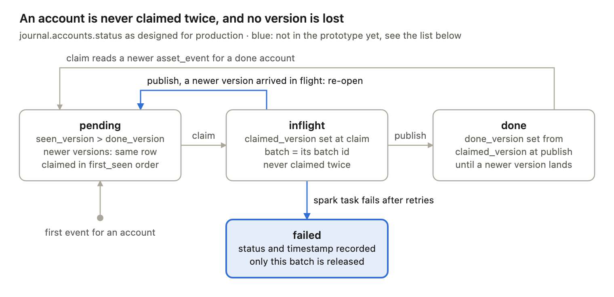

# Account-grain revenue on Airflow 3.3: two grains, one bucket

October 1, 2026 · a design note for review

## Summary

**Trigger at account granularity, execute at batch granularity, and put a leaky bucket between the two.** In Airflow terms: producers emit keyed `AssetEvent`s (`partition_key` = firm account), but no Dag subscribes to them per partition; a batcher Dag drains a journal table of pending accounts into mapped tasks capped by a pool; balance sheet stays on an OR schedule with a version-aware gate.

The reason is the scheduler. Native account-grain partitions mean one `DagRun` per account, and the scheduler pays per run: 100,000 one-task runs cost 0.7 to 1.1 hours of scheduler time a day as a lower bound. As shipped, a 100,000-account test finished 3,698 runs in 26 minutes before it was stopped.

This asks for two things. A decision to build the journal and a continuously running dispatcher, then test them on a firm MWAA environment. And two answers from the data side: what an absent account means in the positions feed, and where the list of accounts expected on a business date comes from.

Everything here was measured on Airflow 3.3.2 with Postgres 16 and the LocalExecutor on a laptop. Nothing has run on MWAA yet, and the prototype has known gaps, listed in section 8.

## 1. Vocabulary

Every later section uses these names. The table column is where the thing lives in the Airflow metadata database (Postgres); the last three rows are ours, not Airflow's.

| Airflow term | What it is | Table | Role in this design |
| --- | --- | --- | --- |
| Dag | A workflow definition, parsed from a `.py` file by the dag-processor | `dag` | Producer Dags, the batcher Dag, the balance-sheet Dag |
| DagRun | One execution of a Dag | `dag_run` | One per batcher tick; never one per account |
| TaskInstance | One task in one DagRun; a mapped task has one per `map_index` | `task_instance` | Each batch is one mapped TaskInstance |
| Pool | A named set of slots a task must hold to run | `slot_pool` | Size = engine capacity K |
| Asset | A named dataset Dags produce and consume | `asset` | `positions`, `pnl` |
| AssetEvent | One immutable record that an asset was updated; optional `partition_key` and `extra` | `asset_event` | One per changed account, version in `extra` |
| asset\_dag\_run\_queue | One pending row per (asset, consumer Dag); deleted when the run is created | `asset_dag_run_queue` | Used only by unkeyed events (balance sheet) |
| PartitionedAssetTimetable | A schedule that creates one DagRun per partition key | (on `dag`) | Deliberately not used on account-keyed assets |
| AssetPartitionDagRun (APDR) | A pending per-key run for a partitioned consumer | `asset_partition_dag_run` | Never written in this design |
| PartitionedAssetKeyLog (PAKL) | Which upstream keys fed an APDR | `partitioned_asset_key_log` | Never written in this design |
| Asset state store | Key-value store per (asset, key), overwritable | `asset_state_store` | Not used; the journal replaces it |
| XCom | Small values passed between tasks | `xcom` | Batch lists from `claim` to the mapped tasks |
| scheduler | Loop that reads the DB, creates DagRuns, queues TaskInstances; the executor runs inside it | `job` | Unchanged |
| api-server | Serves the UI, the REST API and the Execution API that workers call | (writes for workers) | Records events, XCom and task states |
| triggerer | Runs deferrable waits and asset watchers | `job` | Waits on the engine in production |
| Journal | One row per account: pending, in flight, done, with versions | `bench_ledger.accounts` in the prototype | The bucket |
| Batcher Dag | `claim`, then mapped compute tasks on the pool, then `publish` | `dag_run`, `task_instance` | The dispatcher |
| Watermark | Timestamp of the last `asset_event` the batcher has read | stored with the journal | Read position |

## 2. How Airflow 3.3 turns data into runs

An asset update becomes a run by one of three paths, and the path depends on two things: whether the `AssetEvent` carries a `partition_key`, and whether any Dag subscribes to that asset per partition. All rows below are real rows from the test database.



<sub>asset event routing in Airflow 3.3 · three paths · vector: [two-grains-paths.svg](img/two-grains-paths.svg)</sub>

<details><summary>Text version of this figure</summary>

| Path | The event | What the api-server and scheduler write | Result |
| --- | --- | --- | --- |
| A | unkeyed (balance sheet) | one `asset_dag_run_queue` row per consumer Dag | a consumer DagRun when the condition holds |
| B | keyed, consumer has `PartitionedAssetTimetable` (native) | one APDR + PAKL row per partition key | one DagRun per key: 100,000 a day at account grain |
| C | keyed, no partitioned consumer (this design) | nothing: no queue row, no APDR | the batcher Dag reads the `asset_event` rows into the journal each tick |

</details>

Path B is native account grain and costs one run per account; Path C is this design, where Airflow schedules nothing per account.

**Path A: unkeyed event, normal consumer (balance sheet).** When the producer task succeeds, the api-server writes one `asset_event` row and one `asset_dag_run_queue` row per consumer Dag. Each scheduler loop checks the consumer's asset condition; when it holds, the scheduler creates a `DagRun` and deletes the queue rows it consumed.

| `asset_event`.id | asset | partition\_key | extra |
| --- | --- | --- | --- |
| 131514 | bs\_ref\_rates | (none) | `{"as_of": "2026-09-30", "version": 1, "path": "s3://bs/rates/2026-09-30/v1"}` |
| 131515 | bs\_root\_positions | (none) | `{"as_of": "2026-09-30", "version": 1, ...}` |

The queue still holds two rows from the AND experiment. The consumer `exp_e2_consumer_and` needs three assets; two of them have a pending row and the third never got a new event, so it has waited since 15:43 and will wait forever. That is the AND limitation, visible as table rows.

| `asset_dag_run_queue`.asset\_id | target\_dag\_id | created\_at |
| --- | --- | --- |
| 4 | exp\_e2\_consumer\_and | 2026-09-30 15:43:01 |
| 2 | exp\_e2\_consumer\_and | 2026-09-30 15:43:31 |

**Path B: keyed event, partitioned consumer (native account grain).** A keyed event writes no queue row. Instead, a Dag with `PartitionedAssetTimetable` gets one `asset_partition_dag_run` (APDR) row per key, a `partitioned_asset_key_log` (PAKL) row linking it to the event, and then one `DagRun` per key. One account `ACCT00000937` from the 100k test, followed through five tables:

| Table | id | Key columns |
| --- | --- | --- |
| `asset_event` | 194031 | asset `bench_accounts`, partition\_key `ACCT00000937`, source\_dag\_id `bench_partition_producer`, 18:36:57 |
| `asset_partition_dag_run` | 153582 | target\_dag\_id `bench_partition_consumer`, partition\_key `ACCT00000937`, created\_dag\_run\_id 164133 |
| `partitioned_asset_key_log` | 153583 | asset\_event\_id 194031 → asset\_partition\_dag\_run\_id 153582, source key = target key |
| `dag_run` | 164133 | run\_type `asset_triggered`, partition\_key `ACCT00000937`, state `success`, created 18:37:01 |
| `task_instance` |  | task `process_partition`, map\_index -1, pool `default_pool`, success |

Multiply by 100,000 accounts a day: 100,000 rows in each of these tables and 100,000 `DagRun`s for the scheduler to drive. Section 3 shows what that costs.

**Path C: keyed event, no partitioned consumer (this design).** The api-server writes the `asset_event` rows and nothing else: no queue row, because the event is keyed; no APDR row, because nobody subscribes per partition. Airflow schedules nothing. The batcher Dag reads these rows on its own cadence.

| `asset_event`.id | asset | partition\_key | extra | source\_dag\_id |
| --- | --- | --- | --- | --- |
| 547610 | rev5\_positions | ACC100037 | `{"version": 1}` | rev5\_producer |
| 547609 | rev5\_positions | ACC100040 | `{"version": 1}` | rev5\_producer |
| 547608 | rev5\_positions | ACC100039 | `{"version": 1}` | rev5\_producer |

The rule that keeps Path C in place: no Dag may put `PartitionedAssetTimetable` on these assets. In the first 100k batcher test a per-partition test consumer was switched on and turned Path C back into Path B, creating 54,000 runs.

## 3. Why one run per account fails at 100,000

The scheduler pays per `DagRun`, and Path B gives it one per account. Three walls were measured; the second is the one no index removes.

**The scheduler loop.** Each loop of `SchedulerJobRunner._do_scheduling` creates new `DagRun`s (for partitioned consumers, at most `MAX_PARTITION_DAG_RUNS_PER_LOOP` = 500 APDR rows per loop), examines up to `max_dagruns_per_loop_to_schedule` running `DagRun`s (default 20; the tests used 200), and moves ready `TaskInstance`s to queued inside a critical section. The executor runs in the same process and the same loop. Each look at a run schedules every task whose upstream is done, so the number of looks follows the longest chain of tasks:

```math
T_{scheduler} \approx N_{runs} \times (L_{longest\ chain} + 1) \times c_{look}, \qquad c_{look} \approx 12\text{–}20\ \text{ms}
```

A one-task run, which needs two looks, measured 25 to 40 ms of scheduler time in total (26 to 42 runs finished per second). For 100,000 one-task runs that is 0.7 to 1.1 hours a day as a lower bound, before any business work.

| Wall | Shape | Measured | Limit it hits |
| --- | --- | --- | --- |
| 1 | 100,000 mapped `TaskInstance`s in one `DagRun` | Expansion blocks the scheduler loop 315 s (10k: 60 s, 30k: 114 s); an upstream backport cuts 100k to 173 s | `scheduler_health_check_threshold` = 30 s; a health probe would restart the scheduler mid-transaction |
| 2 | One `DagRun` per account (Path B), as shipped | 3,698 of 100,000 runs finished in 26 min, at 3 to 10 runs/s; about 2.8 h at the best rate | Per-run scheduler cost |
| 2b | Same, with three hand-made indexes and two schedulers | All 100,000 finished in 31 min, about 110 runs/s | Needs DB access MWAA does not give |
| 3 | Registering 500 keys in one task-success call | 3.6 s on an empty APDR table, 7.0 s at 64,000 rows; about 5 ms per key under an asset row lock | `[workers] execution_api_timeout` = 5 s; clients retry; at most about 900 keys per task |

**Why wall 3 grows with the table.** For every emitted key, `AssetManager._get_or_create_apdr` looks up the latest APDR row for that key, and every scheduler loop scans for pending rows. On Airflow 3.3 neither query has an index. Measured on a fresh Postgres 16 database with 100,000 APDR rows, using the same ORM expressions as Airflow main:

```sql
-- per emitted key, inside the task-success request
SELECT * FROM asset_partition_dag_run
 WHERE partition_key = 'acct_50000' AND target_dag_id = 'consumer'
 ORDER BY id DESC LIMIT 1;

-- every scheduler loop
SELECT asset_partition_dag_run.* FROM asset_partition_dag_run
  JOIN dag ON dag.dag_id = asset_partition_dag_run.target_dag_id
 WHERE asset_partition_dag_run.created_dag_run_id IS NULL
   AND dag.is_paused IS false AND dag.is_draining IS false AND dag.is_stale IS false
 ORDER BY asset_partition_dag_run.created_at, asset_partition_dag_run.id
 LIMIT 500 FOR UPDATE OF asset_partition_dag_run SKIP LOCKED;
```

| Query | Without index | With the two indexes from apache/airflow#73983 |
| --- | --- | --- |
| Per-key lookup | Seq Scan + Sort, 99,999 rows filtered, 935 buffers, 6.96 ms | Index Scan Backward, 4 buffers, 0.008 ms |
| Scheduler pending scan | Seq Scan, 99,500 rows filtered, 935 buffers, 3.72 ms | Index Scan on `created_dag_run_id IS NULL`, 11 buffers, 0.43 ms |
| Deleting 100 `dag_run` rows (FK cascade) | 360 ms in the FK trigger | 0.42 ms |



<sub>request_durations.csv from the 100k run on Airflow 3.3.2 (bench/results/part_100k_e200) · 27 samples · vector: [two-grains-write-path.svg](img/two-grains-write-path.svg)</sub>

<details><summary>Text version of this figure</summary>

```
rows in APDR   seconds per 500-key request   (█ = 0.25 s; the 5 s execution_api_timeout is 20 █)

        0      ██████████████ 3.6 s
    4,000      ███████████████ 3.7 s
    8,000      ███████████████ 3.8 s
   12,000      ████████████████ 3.9 s
   16,000      █████████████████ 4.2 s
   20,000      █████████████████ 4.2 s
   24,000      ██████████████████ 4.6 s
   28,000      ███████████████████ 4.8 s
   32,000      ████████████████████ 5.0 s
   36,000      █████████████████████ 5.3 s  over 5 s
   40,000      ███████████████████████ 5.7 s  over 5 s
   44,000      ████████████████████████ 6.0 s  over 5 s
   48,000      ████████████████████████ 6.1 s  over 5 s
   52,000      ███████████████████████████ 6.7 s  over 5 s
   56,000      ██████████████████████████ 6.4 s  over 5 s
   60,000      ███████████████████████████ 6.7 s  over 5 s
   64,000      ████████████████████████████ 7.0 s  over 5 s
   64,500      ████████████████████████████ 7.1 s  over 5 s
   65,000      ████████████████████████████ 7.0 s  over 5 s
        ---- index created online: (target_dag_id, partition_key, id) ----
   65,500      ████████████████ 3.9 s
   66,000      ██████████████ 3.5 s
   66,500      ██████████████ 3.4 s
   67,000      ██████████████ 3.5 s
   67,500      ███████████████ 3.7 s
   68,000      ██████████████ 3.4 s
   68,500      ██████████████ 3.4 s
   69,000      ██████████████ 3.5 s
```

</details>

In the live 100,000-key run the request passed the 5-second client timeout at about 36,000 rows, and clients began to time out and retry. The index, created online mid-run, brought the next request back to 3.9 s.

The index fixes wall 3 and part of wall 2b, but MWAA's managed database does not let us add it, and it does nothing for wall 2: 100,000 runs still cost 100,000 runs of scheduler work.

## 4. The design: two grains, one bucket

Three pieces: a producer that tags accounts on its events, a journal table that is the bucket, and a batcher Dag that drains it at the engine's capacity. Airflow keeps every scheduling and execution job; the journal only records which accounts have unprocessed versions.

**Producer Dag.** The task that lands positions declares the asset as an outlet, puts the version in `extra`, and tags every changed account. This writes one `asset_event` row per account (Path C) and schedules nothing.

```python
@task(outlets=[POSITIONS])
def land(params=None, *, outlet_events=None):
    outlet_events[POSITIONS].extra = {"version": int(params["version"])}
    outlet_events[POSITIONS].add_partitions(list(params["accounts"]))   # <= ~900 keys per task
```

**Journal table (the bucket).** One row per account. Repeated versions of an account that arrive while it waits collapse into one row. Production needs `claimed_version`, which the prototype lacks (section 5).

```sql
CREATE TABLE journal.accounts (
    account          text PRIMARY KEY,
    status           text NOT NULL DEFAULT 'pending',   -- pending | inflight | done | failed
    seen_version     int  NOT NULL DEFAULT 0,            -- newest version read from asset_event
    claimed_version  int,                                -- version a batch took (production only)
    done_version     int  NOT NULL DEFAULT -1,           -- version last published
    first_seen       timestamptz NOT NULL,               -- when it started waiting
    batch            text,                               -- batch id while in flight
    updated_at       timestamptz NOT NULL DEFAULT now()
);
```

Real rows from the 100k test, taken when the 40-minute window closed (84,000 done, 6,000 in flight, 10,040 pending):

| account | status | seen\_version | done\_version | first\_seen | batch |
| --- | --- | --- | --- | --- | --- |
| ACC00001 | done | 1 | 1 | 20:02:43 |  |
| ACC00167 | inflight | 1 | -1 | 20:07:00 | `scheduled__2026-09-30T20:45:00#1` |
| ACC00170 | inflight | 1 | -1 | 20:07:09 | `scheduled__2026-09-30T20:45:00#5` |
| ACC00178 | pending | 1 | -1 | 20:07:24 |  |

**Batcher Dag (the dispatcher).** One `DagRun` per tick; inside it, `claim` returns a list of batches through XCom, one mapped `spark` task runs per batch on the `spark_jobs` pool, and one mapped `publish` task per batch closes it.

```python
@dag(schedule="* * * * *", max_active_runs=4)            # production: a continuously running dispatcher
def batcher():
    batches = claim()                                     # read new asset_events past the watermark, upsert journal, claim
    done = spark.override(pool="spark_jobs").expand(batch=batches)   # one TaskInstance per batch, at most K at once
    publish.expand(batch=done)                            # mark done, emit keyed events on the pnl asset for lineage
```

The claim is one transaction, so two batcher runs never take the same account:

```sql
SELECT account FROM journal.accounts
 WHERE status = 'pending' AND seen_version > done_version
 ORDER BY first_seen
 FOR UPDATE SKIP LOCKED;
-- plan batches, then:
UPDATE journal.accounts SET status = 'inflight', batch = :batch_id WHERE account = ANY(:batch);
```

A real batcher run from the test, as `task_instance` rows: `claim` (map\_index -1, success), `spark` map\_index 0 to 4 in pool `spark_jobs`, `publish` map\_index 0 to 4, and `release` skipped because nothing failed. Twelve `TaskInstance`s carried 3,000 accounts.

**Batch sizing.** Each tick computes a target from the measured arrival rate λ, engine start-up S, per-account time p and the latency target, raises it to a floor that keeps the K slots ahead of arrivals, then splits everything pending across the free slots up to a cap (`b_max`, 600 in the 100k test). In a trickle the latency term decides; in a burst the backlog and the cap decide.

```math
b_{sla} = \frac{target - S}{1/\lambda + p}
```

| Airflow does | We own |
| --- | --- |
| Wake the batcher (cron, or later an asset watcher in the triggerer) | The journal table and its schema |
| Run, retry and log every batch as a `TaskInstance` | `claim`: upsert from events, atomic claim, batch sizing |
| Cap running batches with a pool of K slots | `publish`: mark done, emit lineage |
| Wait on Glue or Spark without holding a worker (deferrable operators) | The rule that the journal holds no timing, dependency or retry logic |
| UI, run history, clear and rerun of a batch | Cleanup of closed accounts |

## 5. Overlapping reruns, row by row

The journal answers the overlap question with three rules: an account in flight is never claimed again, unrelated accounts never wait for each other, and versions that pile up while an account waits collapse into one recompute. Today's prototype breaks the third rule for an account that is already in flight; the fix is one column.



<sub>journal.accounts row lifecycle · 4 states, 2 transitions still to build · vector: [two-grains-journal-states.svg](img/two-grains-journal-states.svg)</sub>

<details><summary>Text version of this figure</summary>

| From | Event | To | In the prototype? |
| --- | --- | --- | --- |
| (no row) | first event for an account | `pending` | yes |
| `pending` | newer version read | `pending`, same row, `seen_version` rises | yes |
| `pending` | `claim` (`FOR UPDATE SKIP LOCKED`) | `inflight`, `claimed_version` set | yes, without `claimed_version` |
| `inflight` | newer version read | `inflight`, `seen_version` rises, never claimed twice | yes |
| `inflight` | `publish`, no newer version | `done`, `done_version` = `claimed_version` | yes |
| `inflight` | `publish`, a newer version arrived in flight | `pending` (re-open) | **no**: the prototype marks it done |
| `inflight` | spark task fails after retries | `failed`, status and timestamp recorded, only this batch released | **no**: the prototype returns every batch of the run to pending |
| `done` | `claim` reads a newer `asset_event` | `pending` | yes |

</details>

The two blue paths are the fixes listed under the scenario. Today the prototype marks an account done even when a newer version arrived in flight, and on a failure it returns every batch of the run to pending.

The scenario: accounts 1, 2 and 3 are running in batch A; an adjustment for 3 and 4 arrives, then one for 4 and 5. Each cell shows the journal row for that account: status, then seen / claimed / done version. Accounts 1 and 2 only finish with batch A and are left out.

| Step | What happens | Account 3 | Account 4 | Account 5 |
| --- | --- | --- | --- | --- |
| 0 | Batch A is running | inflight · 1 / 1 / 0 | done · 1 / 1 / 1 | (no row) |
| 1 | Adjustment for 3, 4 lands; next `claim` reads it | inflight · **2** / 1 / 0 (not claimable) | **pending** · 2 / 1 / 1 | (no row) |
| 2 | A slot is free: `claim` puts 4 in batch B; A is still running | inflight · 2 / 1 / 0 | **inflight** · 2 / 2 / 1 | (no row) |
| 3 | Adjustment for 4, 5 lands | inflight · 2 / 1 / 0 | inflight · **3** / 2 / 1 | **pending** · 1 / – / – |
| 4 | Batch A publishes (it computed version 1 of account 3) | fix: **pending** · 2 / 1 / **1** | inflight · 3 / 2 / 1 | claimed into batch C |
| 5 | Batch B publishes (it computed version 2 of account 4) | claimed into batch D | fix: **pending** · 3 / 2 / **2** | inflight |

- **Never twice at once.** Account 3 is in flight at step 1, so `claim` skips it; the row lock and the `inflight` status make that atomic across batcher runs.
- **No head-of-line blocking.** Account 4 starts in batch B at step 2 while batch A is still running.
- **Coalescing.** Had account 4 been pending when versions 2 and 3 arrived, they would have become one recompute on version 3.
- **The prototype's gap.** At step 4 the prototype sets `done_version = seen_version`, writing 2 for account 3 although batch A computed version 1. Version 2 is then never computed. The fix records `claimed_version` at claim time, sets `done_version = claimed_version` at publish, and re-opens the row when `seen_version > done_version`. Not written or tested yet; this scenario is the proposed test case.
- **Failures.** In the prototype, one failed batch returns every batch of its run to pending, including batches still running, which could compute an account twice. The fix releases only the failed batch and records `status = failed` with a timestamp.

Throughput is the cost of rule one: account 3 waits for batch A even though its new version is known. With a continuously running dispatcher that wait is one batch duration (in the prototype's trickle runs, a 15 to 20 s job); with the prototype's one-minute cron it is up to a minute more.

## 6. Balance sheet: OR schedule plus a version-aware gate

Balance sheet aggregates across accounts, so it uses no bucket: any input arrival wakes the Dag, and a gate task decides whether the business date can be computed and with which versions. A late version 2 of one input reruns the whole date with that version and the latest of everything else, which the native AND schedule cannot do (section 2, Path A).

```python
@dag(schedule=(rates | fx | positions | cashflows), max_active_runs=1)
def bs_pnl():
    @task.short_circuit(inlets=[rates, fx, positions, cashflows])
    def gate(inlet_events=None):
        as_of = ...                                   # business date of the triggering event
        latest = {name: max((e for e in inlet_events[a] if e.extra["as_of"] == as_of),
                            key=lambda e: e.extra["version"], default=None)
                  for name, a in INPUTS.items()}
        return all(latest[n] for n in ("rates", "fx")) and any(latest[n] for n in ("positions", "cashflows"))
    gate() >> calc()                                   # calc reads the chosen versions, emits bs_pnl_out
```

The rule here is "all reference inputs (rates, fx) and at least one root input (positions, cashflows)". Every arrival creates a `DagRun`; `max_active_runs=1` makes arrivals during a run wait and merge into the next one. The real runs from the experiment, one per arrival:

| Time | Event that woke the Dag | `gate` decision | `calc` | Output event `extra` |
| --- | --- | --- | --- | --- |
| 17:25:05 | rates v1 (2026-09-30) | fx missing | skipped |  |
| 17:25:19 | positions v1 | fx missing | skipped |  |
| 17:25:33 | fx v1 | references complete, one root | success | rates 1, fx 1, positions 1 |
| 17:25:49 | cashflows v1 | second root arrived | success | rates 1, fx 1, positions 1, cashflows 1 |
| 17:26:03 | **rates v2** | late version of a reference | **success** | **rates 2**, fx 1, positions 1, cashflows 1 |
| 17:26:17 | positions v1 (2026-10-01) | next date: references missing | skipped |  |
| 17:26:31 | rates v1 (2026-10-01) | fx missing | skipped |  |
| 17:26:45 | fx v1 (2026-10-01) | references complete, one root | success | rates 1, fx 1, positions 1 |

Three details the gate has to get right, all learned in the experiments:

- **Take the highest `extra.version`, not the last event.** `inlet_events[asset][-1]` is the last event registered, which a retried producer can make an older version.
- **Page the event read.** `inlet_events` is unbounded; 10,000 events took 7.6 to 9.1 s, past the 5 s Execution API timeout. Read with `.after(watermark).limit(...)`.
- **Skipped runs are the cost.** Eight runs, four of which computed; each is a `dag_run` row and a few `task_instance` rows. Fine at a few inputs per day, not at 100,000 accounts, which is why revenue uses the bucket.

## 7. Observability: why is this account not done?

Users ask two questions, "where is account X" and "why is it not done yet", and both are one query on the journal. The Airflow UI stays for operators: it shows batches as `TaskInstance`s, not accounts. What is missing today is the reason, which `claim` and the balance-sheet gate already know and do not write down.

Real state of the journal when the 100k test's 40-minute window closed, with 10 batches in flight:

```sql
SELECT status, count(*) AS accounts, min(first_seen) AS oldest
  FROM journal.accounts GROUP BY status;
```

| status | accounts | oldest first\_seen |
| --- | --- | --- |
| done | 84,000 | 20:02:41 |
| pending | 10,040 | 20:07:22 |
| inflight | 6,000 | 20:06:58 |

One account, with its place in the queue computed from `first_seen`:

| account | status | seen\_version | done\_version | waiting since | queue position |
| --- | --- | --- | --- | --- | --- |
| ACC00178 | pending | 1 | -1 | 20:07:24 | 415 |

**The reason column (proposed, not built).** `claim` knows why it skipped an account, and the gate knows which inputs a business date lacks. Writing that down turns the question into a lookup:

| reason | Written by | What it would show |
| --- | --- | --- |
| `waiting_for_capacity` | `claim`, when all K slots are busy | 10 of 10 slots busy; position 415 |
| `waiting_for_inflight` | `claim`, when the account is in a running batch | Batch `scheduled__…#1` still running |
| `waiting_for_input` | balance-sheet gate, per business date | 2026-10-01: fx missing |
| `failed` | `publish` or `release`, with error and time | The batch's error and the time it failed |

Today the gate's decision exists only in its task log, and `claim` logs only counts.

**Why not Airflow's own APIs.** The REST endpoint for asset events cannot filter by `partition_key` on 3.3 (the index and filter arrive in 3.4), so finding one account means scanning. The asset state store is reachable through `/api/v2/assets/{id}/state-store`, but only as key lookups or paged lists, with no filter by status. On MWAA, the REST API also sits behind a default throttle of 10 requests per second, which AWS Support can raise. A view on the journal, in a database users can already query, has none of these limits.

## 8. Measured, designed, open

Nine of the claims in this doc were measured or simulated; two are known gaps in the prototype; two are designed but not built; five are open questions, two of which only the data side can answer. Evidence links go to the public test repository.

| Claim | Evidence | Status |
| --- | --- | --- |
| 100,000 mapped `TaskInstance`s in one `DagRun` block the scheduler loop 315 s | [REPORT §4.1](../REPORT.md) | Measured |
| One `DagRun` per account as shipped: 3,698 of 100,000 finished in 26 min, 3 to 10 runs/s | [REPORT §4.2](../REPORT.md) | Measured |
| Same with three hand-made indexes and two schedulers: 31 min | [REPORT §4.2a](../REPORT.md) | Measured |
| Registering 500 keys: 3.6 s empty, 7.0 s at 64,000 APDR rows; about 900 keys per task at most | [REPORT §4.2](../REPORT.md) | Measured |
| 100,000 accounts as 100 batches of 1,000 in one `DagRun`: 38 s | [REPORT §4.5](../REPORT.md) | Measured |
| Bucket at 100k: 84,000 of 100,040 published in 40 min; about 2,800 a minute against 13,000 of capacity | [dynamic-batching §5a](dynamic-batching.md) | Measured |
| `claim` took 36 to 388 s per tick while 200 producers were registering keys | [dynamic-batching §5a](dynamic-batching.md) | Measured |
| Engine start-up sets latency: 60 s start-up misses a 2-min burst p95 (best 7.2 min); about 10 s meets it | [dynamic-batching §2](dynamic-batching.md) | Simulated |
| Balance sheet: OR schedule plus gate recomputes the date on a late version 2 | Section 6, experiment E6 | Measured |
| A version arriving while its account is in flight is marked done without being computed | `ledger_pg.py` `done()`; section 5 | Known gap |
| One failed batch releases every batch of its run, including running ones | `release` task; section 5 | Known gap |
| Continuous dispatcher that claims as slots free up | [design-core §3](design-core.md) | Designed, not built |
| Status view, reason column and failed state | Section 7 | Designed, not built |
| Journal in RDS or DynamoDB, written from MWAA workers | Prototype used a schema in the local Postgres | Open question |
| MWAA's task API inside its webserver containers under per-key registration load | Not run on MWAA | Open question |
| Positions feed: full snapshot or deltas, and are zero-position accounts included | Data owner | Open question |
| Where the list of accounts expected on a business date comes from | Data owner, account master | Open question |
| Kafka or SQS feeding the bucket through an asset watcher | Not tried; section 9 | Open question |

## 9. Extension: the same bucket on Kafka

The batcher is a Kafka consumer in shape, and the half that comes for free is reversed: Airflow gives the orchestration and we write the bucket; Kafka gives the bucket and we would write the orchestration.

| Kafka | This design |
| --- | --- |
| Keyed messages on a topic | `asset_event` rows with `partition_key` |
| Consumer offset | Watermark: timestamp of the last event read, re-read with a 5 s overlap, advanced at `claim` before processing |
| Kafka Streams KTable, latest value per key (log compaction alone is lazy; a live consumer still reads every version) | Journal row per account, coalesced on write |
| Poll and batch | `claim` and batch sizing |
| Pull pace (`max.poll.records`, `pause()`/`resume()`), parallelism bounded by partitions | Pool of K slots |
| Commit after processing | `publish` marks each account done; tracked per account, not by read position |

|  | Airflow | Kafka |
| --- | --- | --- |
| Native | Triggering, retries, deferrable waits on Spark or Glue, run history, UI, lineage; same platform as balance sheet; offered as MWAA | Offsets, consumer groups, millisecond delivery, per-key state through Kafka Streams |
| We write | The journal and `claim` / `publish` | Launching and retrying engine jobs, recording what each batch ran, a UI, lineage |
| Latency floor | About a minute in the prototype: trickle p95 77 s including a 15 to 20 s job | Milliseconds of delivery |

The millisecond advantage pays off only with a fast engine. In the simulator (a 10,000-account burst, then 1 account/s, K = 20) burst latency is set by engine capacity and trickle latency by engine start-up: with 60 s start-up the best burst p95 is 7.2 min whatever the message path; with about 10 s, SLA-sized batches meet 2 minutes in both phases.

A hybrid exists in principle. An `AssetWatcher` with the common.messaging provider's `MessageQueueTrigger` runs in the triggerer and wakes a Dag from Kafka, SQS, Redis pub/sub, Google Pub/Sub, Azure Service Bus or IBM MQ (Kinesis is merged but not released; MWAA 3.3.1 bundles Amazon provider 9.34.0). Two differences from the keyed path: a watcher's event carries no `partition_key`, so the account travels in `extra["payload"]`; and the Kafka trigger commits each offset before Airflow records the event, one message per trigger run. Not tried here, and not on MWAA.

## 10. Decisions and questions

Four decisions move this forward, and five questions need someone other than the author to answer them.

**Decisions needed**

- [ ] Revenue at account grain uses the two-grain design: keyed events, a journal, a batcher Dag; no one `DagRun` per account.
- [ ] Next build: `claimed_version`, a `failed` state, a continuously running dispatcher, and the reason column; the overlap scenario in section 5 is the acceptance test.
- [ ] Run it on a firm MWAA environment wired to the revenue demo, which answers the MWAA questions in section 8.
- [ ] Where the journal lives (RDS table or DynamoDB with conditional writes) and who owns it.

**Questions for the data side**

- Is the positions feed a full snapshot per business date or only changes, and are zero-position accounts included? If an account's positions go to zero and it simply disappears, its PnL stays at yesterday's value unless the journal compares against the previous day.
- Where does the list of accounts expected on a business date come from? Accounts open and close daily, and "no event" only means "no data" against that list.
- Is the 2-minute p95 meant for the intraday trickle only, or the start-of-day burst too, and what are the engine's start-up time and concurrency? Those two numbers decide the batch sizes.

**Questions on the bucket design**

- Would you keep the bucket as a table, or put it in Kafka or SQS and let Airflow only orchestrate?
- In a production leaky-bucket or Kafka consumer, what happens to an update that arrives while its key is being processed, and how is a failed batch replayed?
